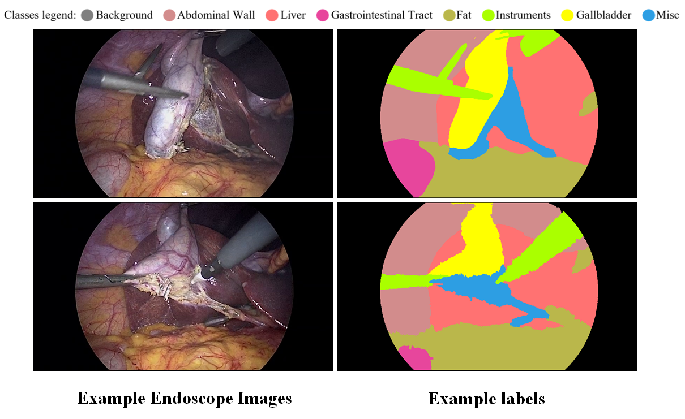

# F2PASeg

* ### 介绍
基于SAM2的视频流分割模型，主要针对颅底术内窥镜图像中的6种结构进行分割,可应用于视频流场景和3D医学影像。在原版网络基础上对image encoder，mask decoder等结构进行修改从而优化网络的分割能力。  
网络结构如图所示，Image Encoder，Mask Decoder部分均可替换：  
<p align="center"></p> 

* ### 软件架构
    * __SAM 组件__  
    * __工具箱Tools__  
包括可视化组件，mask分离组件，.json文件生成组件
    * __train & test__  
根据不同使用场景有不同采用不同的train & test模块


* ### 数据集PAS
数据集总共包含7845张来自120个垂体瘤内窥镜手术视频的截图。根据临床意义，由专业外科手术医生从120个视频中选出7845帧图像，每帧图像初始分别率为1920×1080或720×576. 
<p align="center"></p>  
如图所示，我们选取了六种结构作为分割对象：鞍底(sella floor),颈动脉(ICA prominence),视神经(optic prominence),OCR(optic-carotid recess), 斜坡神经(clival recess)和蝶鞍结节(tuberculum sella).  
数据集由专业外科神经外科一生进行像素级标注，最后分为训练集(70)/验证集(10)/测试集(20)用于模型的训练和测试。  

__解剖结构和标注的对应关系如下表:__  
| structure | Sella floor | Tuberculum_sella | ICA_prominence | Clival_recess | Optic_carotid_recess | Optic_prominence |
| --- | --- | --- | --- | --- | --- | --- |
| label | 1 | 2 | 3 | 4 | 5 | 6 |
| colormap(BGR) | (255,150,0) | (0,255,150) | (255,0,255) | (0,150,255) | (0,255,0) | (255,255,0) |

* ### 数据集CholecSeg8K
数据集包含来自17个腹腔镜胆囊切除手术视频的8080张图像以及对应的像素级标注的mask，共有17个case,13个类别，每帧图像分辨率为854×480.  
发布时间: 2020-12  
官方项目链接🔗 [kaggle](https://www.kaggle.com/datasets/newslab/cholecseg8k)  
文章地址🔗 [Arxiv](https://arxiv.org/abs/2012.12453)  
<p align="center"></p>
如图所示，做分割任务时将结缔组织等杂项归为Mis.类，手术器械归为Instruments类，最终得到包括背景在内的8类标注：背景(Background), 腹壁(Abdominal Wall
), 肝脏(Liver), 消化道(Gastrointestinal Tract), 脂肪(Fat), 手术器械(Instruments), 胆囊(Gallbladder)， 杂项(Misc).

__解剖结构和标注的对应关系如下表:__ 
| structure | Background | Abdominal Wall | Liver | Gastrointestinal Tract | Fat | Misc | Instruments | Gallbladder |
| --- | --- | --- | --- | --- | --- | --- | --- | --- |
| label | 0 | 1 | 2 | 3 | 4 | 5 | 6 | 7 | 8 |
|colormap(BGR) | (0, 0, 0) | (140, 140, 210) | (114, 114, 255) | (156, 70, 231) | (75, 183, 186) | (227, 158, 45) | (0, 255, 170) | (0, 255, 255) |


使用时请以如下结构进行分级：

``` 
PASeg
├── train
│   ├── image
│   |      ├── case_0004
│   |         ├── 0.jpg
│   |         ├── 1.jpg
│   |         ├── ...
│   ├── mask
│         ├── case_0004
│            ├── 0.png
│            ├── 1.png
│            ├── ...
├── val
└── test
```


* ### 可视化结果
将*test.py*中的save_pred参数设置为True就能生成对应的预测可视化结果。  
部分结果如图所示：  
<p align="center"></p>    
<p align="center"></p>  
